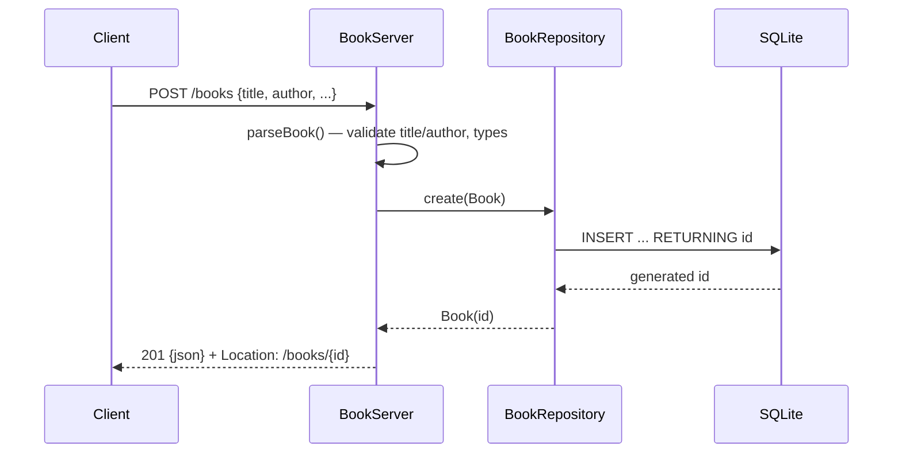

# Flow

A `POST /books` request is read (capped at 1 MiB), parsed as a JSON object, and
validated: `title` and `author` must be non-blank strings, `year` must be an
integer if present, `isbn` a string if present. Validation errors are collected
and returned together as `400 {error, details[]}`. On success `BookRepository.create`
inserts a row via a prepared statement and returns the row with its generated id;
the server responds `201` with the book JSON and a `Location` header. All repository
methods are `synchronized` over a single shared connection. Errors map to HTTP
codes via a private `ApiException`; unexpected exceptions become `500`.
