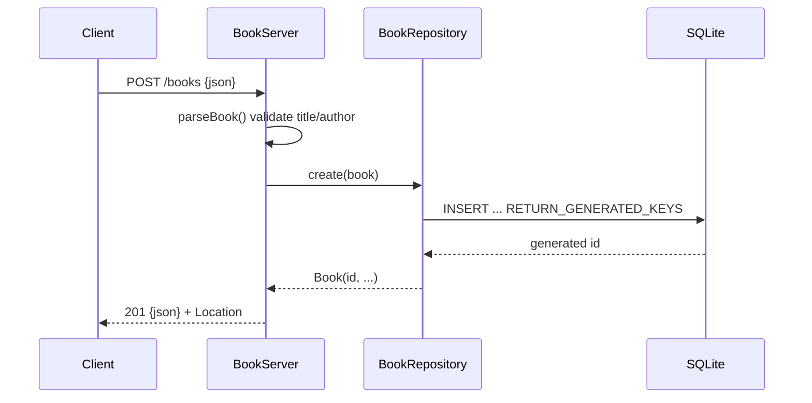

# Flow

A `POST /books` request is dispatched by `BookServer.route`, which calls `parseBook` to
read the body (capped at 1 MiB), reject non-JSON/non-object payloads, and validate that
`title` and `author` are present non-blank strings (collecting all field errors into a
400 `details` list). On success the validated `Book` is handed to
`BookRepository.create`, which inserts via a prepared statement and returns the row with
its generated id; the server responds 201 with the JSON book and a `Location` header. All
repository methods are `synchronized` over a single JDBC connection since the HTTP server
runs a fixed thread pool.
