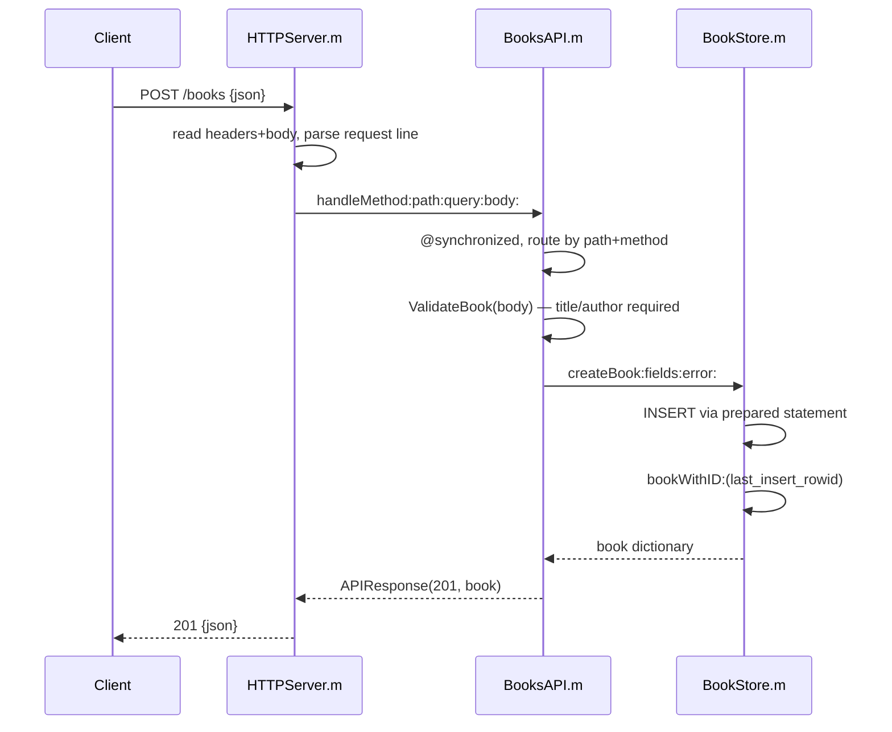

# Flow

A request arrives on a BSD socket; `HTTPServer` reads the header block (bounded at 16 KB) up to `\r\n\r\n`, parses the request line, enforces `Content-Length` limits (max 1 MB, rejects `Transfer-Encoding`), reads the body, and hands method/path/query/body to `BooksAPI`. `BooksAPI` serializes all access with `@synchronized`, strips a trailing slash, and routes: `/books` POST goes to `createBook:`, which validates that `title` and `author` are present non-blank strings (trimming whitespace), coerces optional `year`/`isbn`, then calls `BookStore createBook:` (prepared `INSERT`) and re-reads the row. The resulting `APIResponse` (201 + created book) is serialized to an HTTP response with `Connection: close`.

Notable, factual traits: single SQLite connection guarded by `@synchronized` (correct but serializes all requests despite a concurrent dispatch queue); one request per connection (no keep-alive); IPv4-only host binding; PUT is a full replacement validated like POST; malformed ids (`/books/abc`) resolve to 404 rather than 400; handler exceptions are caught and mapped to 500.
