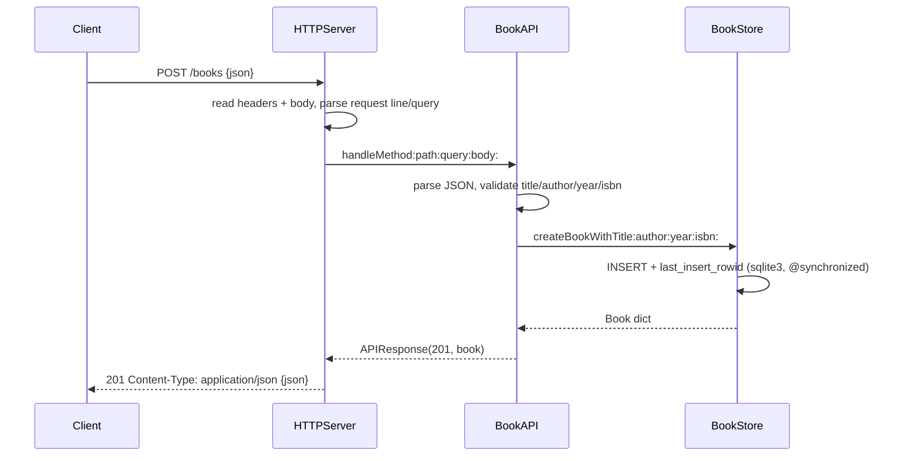

# Flow

A `POST /books` request is read off the socket by `HTTPServer` (headers to `\r\n\r\n`, then Content-Length bytes, with 64 KB header / 1 MB body caps), split into method/path/query, and handed to `BookAPI:handleMethod:`. The router validates the JSON body — `title` and `author` must be non-empty strings, `year` an integer, `isbn` a string — then calls `BookStore` to persist via a parameterized SQLite `INSERT` guarded by `@synchronized`, and returns the stored row as JSON with status 201. Errors return `{"error": ...}` bodies with 400/404/405/413/500 as appropriate. Notable: layered separation of persistence / routing / transport, parameterized SQL (no injection), boolean-vs-integer discrimination on `year`, and a hand-rolled socket server rather than a framework.
