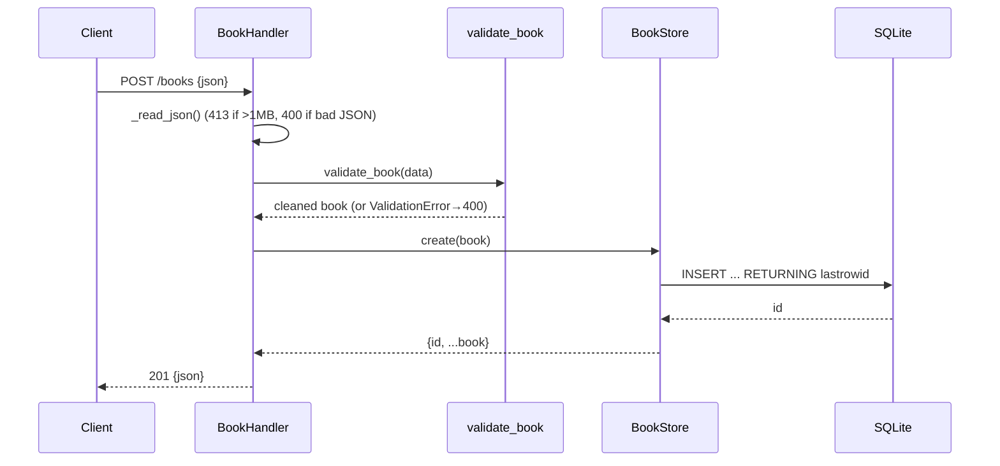

# Flow

A `POST /books` request is dispatched by path in `_dispatch`, its body read and
size-guarded by `_read_json`, then validated by `validate_book` (title/author
required non-empty strings; year int; isbn str). On success `BookStore.create`
opens a short-lived SQLite connection, inserts the row, and returns it with the
new id as `201`. Errors are funneled through `_handle`, which maps
`ValidationError`→400 (with per-field `details`), `HTTPError`→its status, and any
other exception→500. The server is threaded (`ThreadingHTTPServer`) and opens one
connection per operation, so it is safe under concurrent requests.
