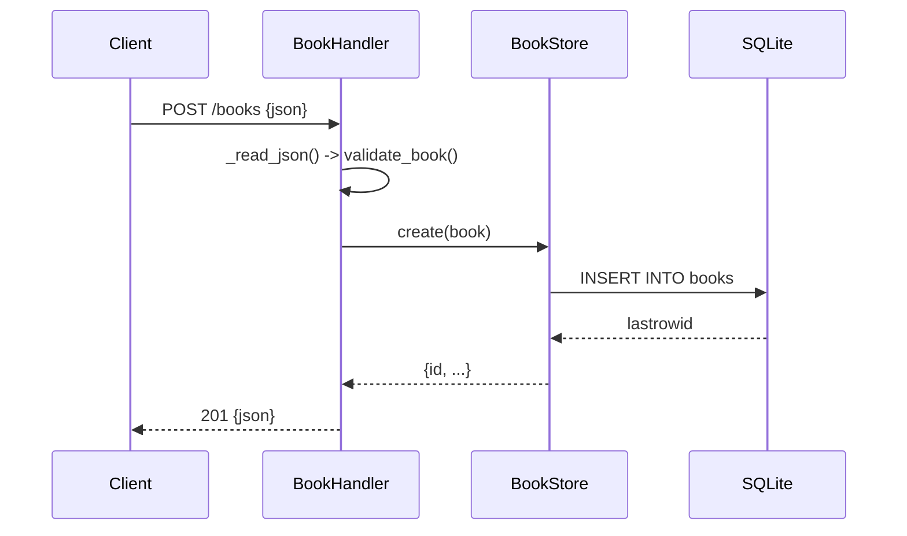

# Flow

A `POST /books` request is dispatched by `BookHandler._route`, which reads the body under
a `Content-Length`/`MAX_BODY_BYTES` guard, parses JSON, and runs `validate_book` (title and
author required, year must be an int, isbn optional-unique). On success it calls
`BookStore.create`, which inserts under a threading lock and returns the persisted row as
JSON with `201`. Validation failures return `422` with a per-field `details` map; malformed
JSON returns `400`; a duplicate `isbn` surfaces the SQLite `UNIQUE` violation as `409`.
Notable: pure standard-library stack (`http.server` + `sqlite3`, no third-party deps);
thread-safe store; validation returns `422` (Unprocessable Entity) rather than the `400`
the task illustrates.
