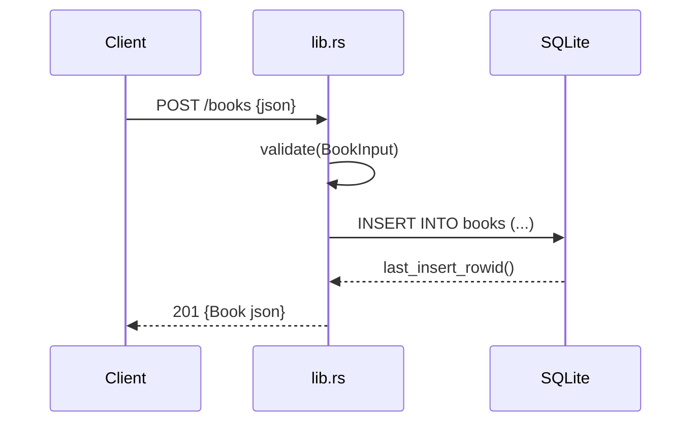

# Flow

A `POST /books` request is deserialized into `BookInput` (all fields `Option` so that a missing required field surfaces as a validation error rather than a JSON parse error). `validate` trims and checks that `title` and `author` are non-blank, returning `422` with a `details` array otherwise. The handler locks the shared `Arc<Mutex<Connection>>`, executes a parameterised `INSERT`, and returns the created `Book` (with the new row id) as `201`. DB access is synchronous under a mutex inside async handlers — acceptable for a single-connection embedded SQLite store. Error handling is centralised through the `ApiError` enum's `IntoResponse` impl.
