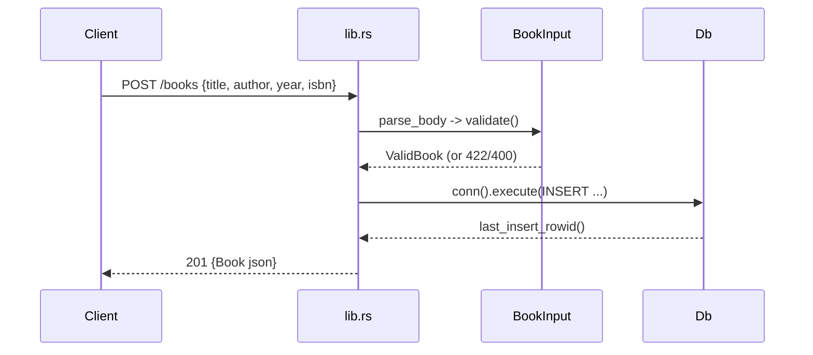

# Flow

A `POST /books` request is deserialized into `BookInput`; `validate()` trims and requires non-blank `title` and `author` (else 422 with a `details` array), malformed/wrong-type JSON yields 400. The valid record is inserted into the SQLite `books` table behind an `Arc<Mutex<Connection>>`, and the row (with its new `id`) is returned as JSON with 201. DB access is synchronous under a mutex inside async handlers — acceptable for this single-connection embedded store; poisoned-lock recovery is handled explicitly.
