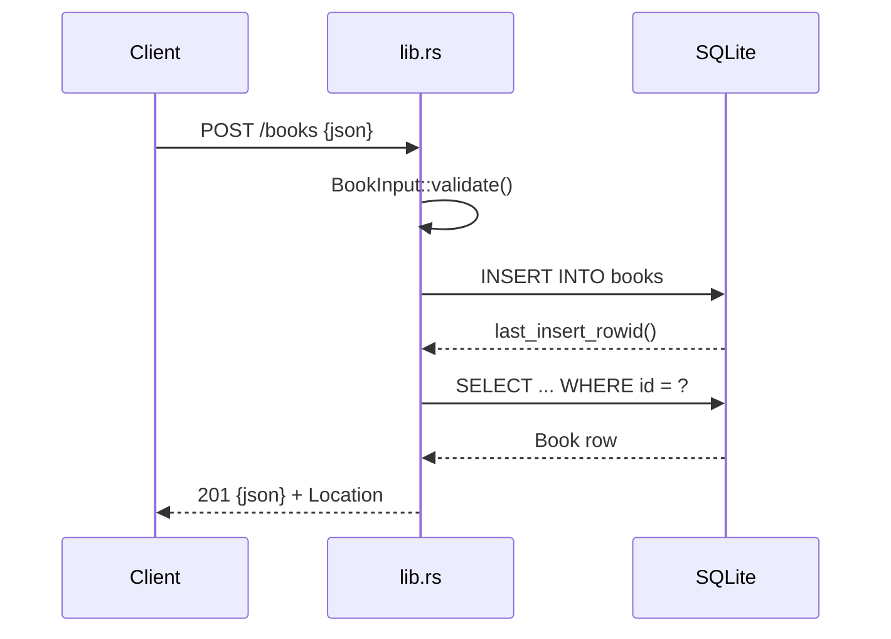

# Flow

A `POST /books` request is deserialized into `BookInput` (all fields optional so a
missing required field yields a descriptive 400 rather than a parse error).
`validate()` trims and rejects empty `title`/`author`. The handler inserts under a
`Mutex<Connection>` guard, then re-reads the row via `fetch()` to return the
persisted record with its assigned id and a `Location` header. Errors flow through
the `ApiError` enum's `IntoResponse`, giving consistent JSON error bodies and status
codes. DB access is synchronous under a global mutex inside async handlers — fine for
this task's scale but a serialization point under concurrency.
