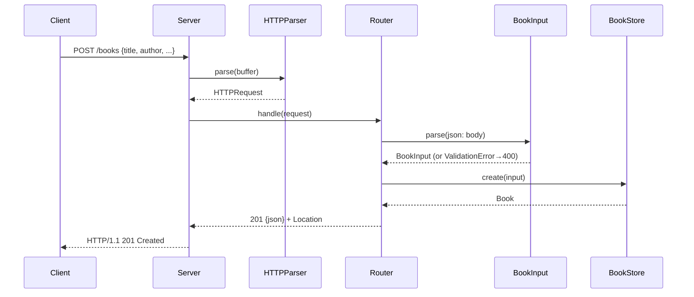

# Flow

A `POST /books` connection is read by `Server.receive`, which feeds bytes to
`HTTPParser.parse` until a full request is available. `Router.handle` dispatches
by path/method, parses and validates the JSON body via `BookInput.parse`
(rejecting missing/empty `title` or `author` with `400`), inserts into SQLite
through the thread-safe `BookStore`, and returns `201` with a `Location` header.
The router is transport-independent, so the same `handle` path is exercised
directly by unit tests and over a real socket by the integration tests.
Notable: no third-party dependencies (Network.framework + system sqlite3);
parameterized SQL guards against injection; one request per connection.
