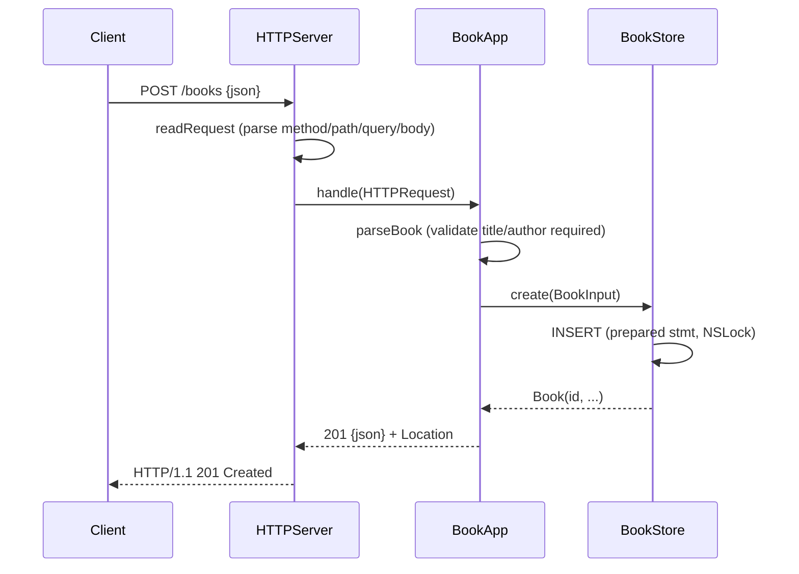

# Flow

A `POST /books` is read off the raw socket by `HTTPServer.readRequest` (bounded header/body sizes, Content-Length enforced, chunked encoding rejected with 501), then dispatched to `BookApp.handle`. `parseBook` decodes the JSON object and collects every validation problem — title and author must be non-empty strings, `year` must be an integer (JSON booleans explicitly excluded), `isbn` must be a string — returning `400` with a `details` array on any failure. On success `BookStore.create` runs a locked prepared INSERT and returns the persisted `Book`, which is serialized to `201` JSON with a `Location` header. The routing layer (`BookApp`) is deliberately decoupled from the socket transport, so tests exercise it directly as well as end-to-end over a real socket.
