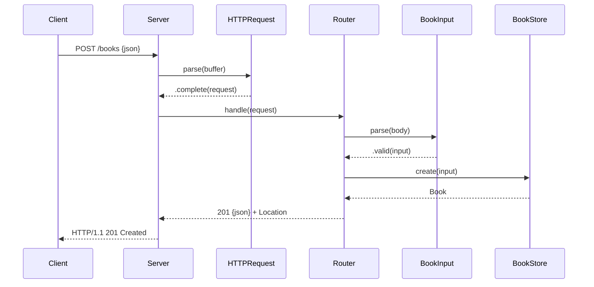

# Flow

A `POST /books` connection is read incrementally by `Server.receive` until `HTTPRequest.parse` returns `.complete`. `Router.route` splits the path, matches `books`, parses the body via `BookInput.parse` (rejecting non-objects with `400` and field-validation failures with `422`), then calls `BookStore.create`, which inserts a bound-parameter row into SQLite and returns the new `Book`. The response is serialized as JSON with a `201` status and a `Location: /books/{id}` header, then the connection is closed. Storage access is guarded by an `NSLock`; validation rejects blank/whitespace `title`/`author`, non-string fields, and non-integral/boolean `year`.
