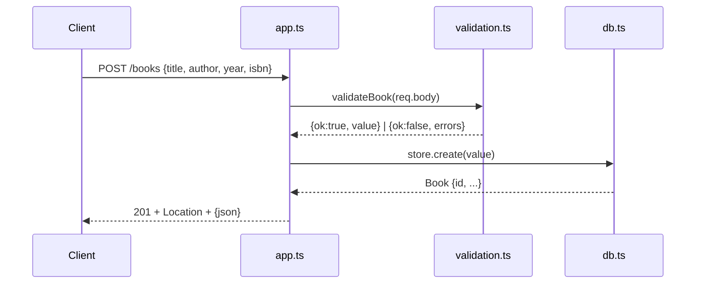

# Flow

A `POST /books` request is JSON-parsed by `express.json()`, validated by
`validateBook` (title/author required non-empty strings; year must be an integer
and isbn a string when present; extra normalization trims strings and defaults
year/isbn to `null`). On success `BookStore.create` runs a prepared INSERT
against SQLite (`node:sqlite`) and the row id is returned with `201` and a
`Location` header. Malformed JSON is caught by a trailing Express error handler
and mapped to `400`. Input validation, error handling, and a catch-all 404 are
all present.
