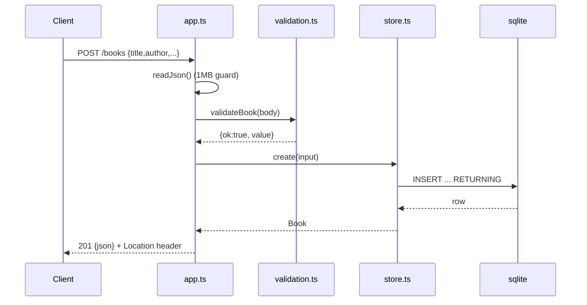

# Flow

A `POST /books` request is read with a 1 MB body cap, JSON-parsed (400 on malformed JSON), and passed to `validateBook`, which enforces required `title`/`author` and typed optional `year`/`isbn`. On success `BookStore.create` runs a parameterized `INSERT ... RETURNING` against `node:sqlite` and the new book is returned with a `201` and a `Location` header. Errors flow through a single `HttpError`-aware `.catch` that maps known errors to their status codes and unknown errors to 500. Input validation, error handling, and parameterized queries are all present.
