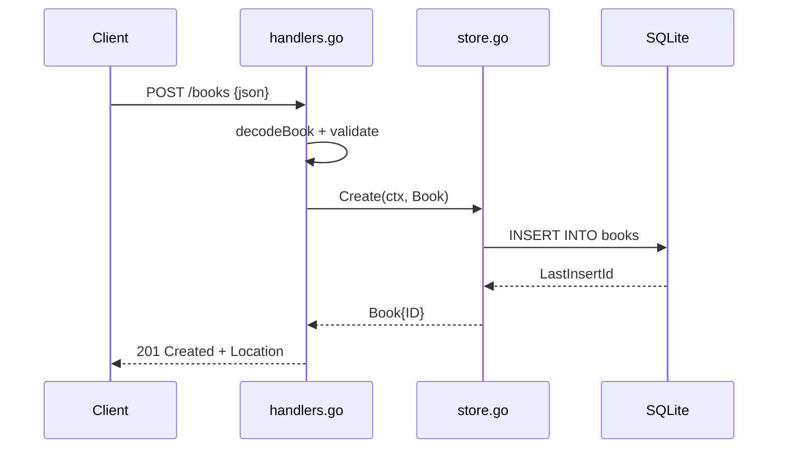

# Flow

A `POST /books` request is size-limited (1 MiB) and decoded by `decodeBook`, which rejects malformed JSON, wrong field types, trailing data, and non-object bodies with `400`. `validate` trims strings and requires non-blank `title` and `author` (and `year` in 0–9999). Valid input is inserted via `store.Create`, and the created book is returned as `201` with a `Location` header. Errors from the store are mapped to `404` (not found) or `500` (other DB errors). Path IDs are parsed as positive integers; an `id` in the body is ignored.
