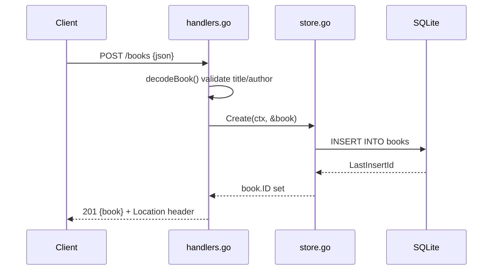

# Flow

A `POST /books` request is decoded by `decodeBook` (`handlers.go:70`), which enforces
strict JSON (`DisallowUnknownFields`-style trailing-token check plus a 1 MiB body cap),
trims and requires `title` and `author`, and rejects a negative `year` — returning 400
with a per-field `details` map on failure. On success `Store.Create` (`store.go:59`)
inserts the row into SQLite and back-fills the generated ID, and the handler responds 201
with the JSON body and a `Location: /books/{id}` header. Errors are funnelled through
`storeError`, which maps `ErrNotFound` to 404 and everything else to 500. Context is
threaded from the request into every DB call, and the server installs a signal-driven
graceful shutdown (`main.go:38-48`).
