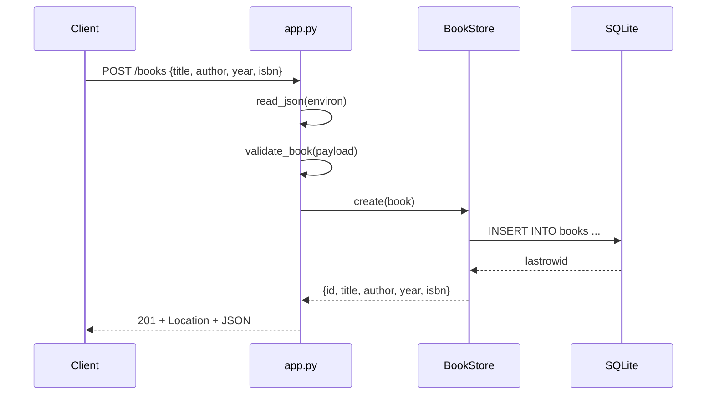

# Flow

A `POST /books` request is routed by `route()`, which reads and size-limits the body (`read_json`, 1 MiB cap), validates it (`validate_book` — `title`/`author` required and trimmed, `year` must be a non-bool int within ±9999, `isbn` optional non-empty string), then inserts via the lock-guarded `BookStore.create`. A duplicate `isbn` raises `sqlite3.IntegrityError`, caught and mapped to `409 Conflict`. On success the handler returns `201` with a `Location` header and the created row as JSON. All handlers run inside a try/except in `app()` that maps `ApiError` to its status and any other exception to a JSON `500`. Notable: single shared SQLite connection guarded by a `threading.Lock` (safe for the threaded/real-HTTP tests); parameterized queries throughout (SQL-injection safe); persistence survives process restarts.
