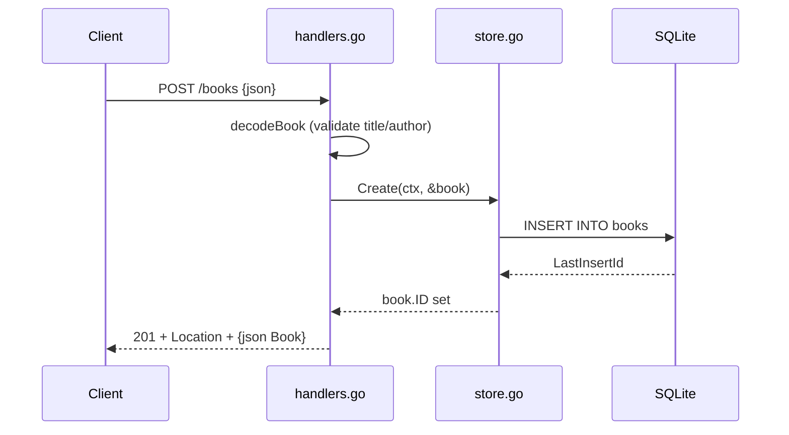

# Flow

A `POST /books` request is decoded and validated by `decodeBook` (title and author required, non-negative year, body size capped at 1 MiB). On success `Store.Create` inserts the row into SQLite and back-fills the generated `ID`, and the handler returns `201 Created` with a `Location` header and the JSON book. Validation failures return `400` with an `{"error","details"}` body listing every problem; store errors map `ErrNotFound` to `404` and everything else to a logged `500`.
