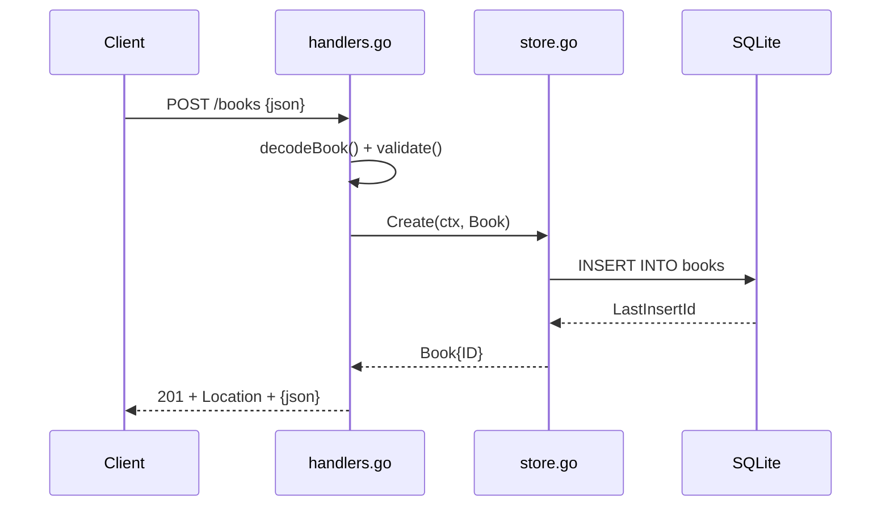

# Flow

A `POST /books` request is decoded with a 1 MiB body cap, then validated
(`title`/`author` required, `year` non-negative); a validation failure short-circuits
to 422 before any DB access. On success the handler inserts the row via
`store.go:Create`, sets a `Location` header from the new ID, and returns the created
book as 201 JSON. Reads (`GET /books`, `GET /books/{id}`) follow the same shape without
the validation step; `GET /health` pings the DB. The server runs on the stdlib
`net/http` method-and-path mux (Go 1.22+) with graceful shutdown wired in `main.go`.
