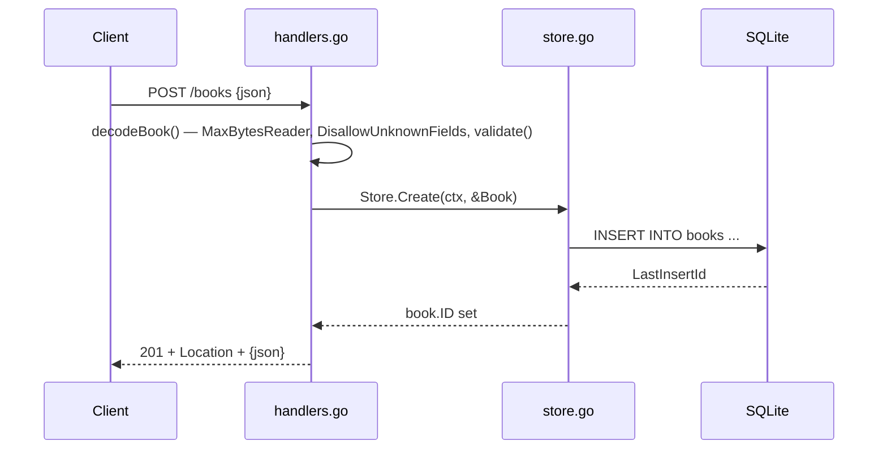

# Flow

A `POST /books` request is decoded by `decodeBook`, which caps the body at 1 MiB,
rejects unknown fields and trailing content, and runs `bookInput.validate()`
(title and author required and trimmed; year must be non-negative). On success the
handler calls `Store.Create`, which inserts the row via a single-connection
SQLite pool (`SetMaxOpenConns(1)`) and populates the generated ID. The handler
sets a `Location: /books/{id}` header and returns `201` with the created book as
JSON. Notable: validation failures return `422` (not `400`); errors are always
JSON; the store maps `sql.ErrNoRows` and zero-rows-affected to `ErrNotFound` so
Get/Update/Delete yield `404`.
