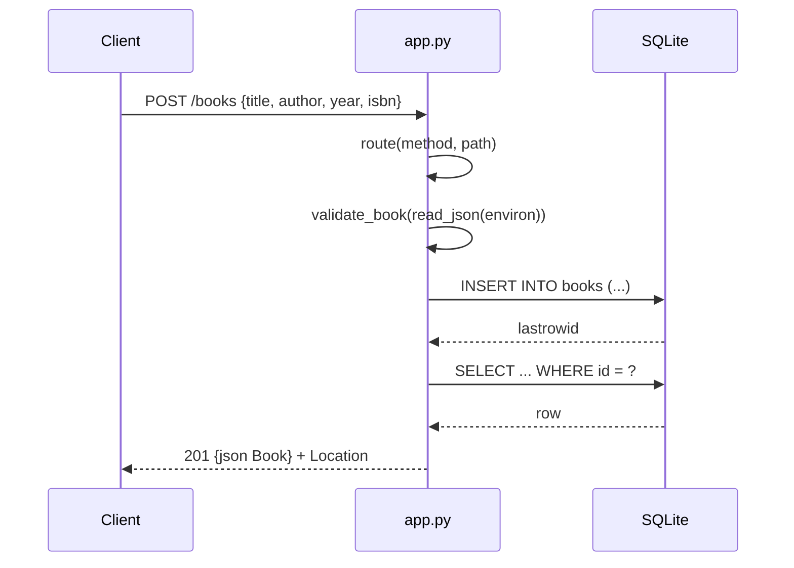

# Flow

A `POST /books` request is dispatched by `route()` to `create_book`, which parses the JSON body via `read_json`, validates that `title`/`author` are non-empty strings (and `year`/`isbn` well-typed) with `validate_book`, then opens a fresh per-request SQLite connection and inserts the row. A duplicate ISBN raises `sqlite3.IntegrityError`, mapped to `409`. On success it re-reads the inserted row and returns `201` with the JSON body and a `Location` header. Each request uses its own short-lived connection (`closing(connect())`); persistence is a real on-disk SQLite file, so data survives across app instances.
