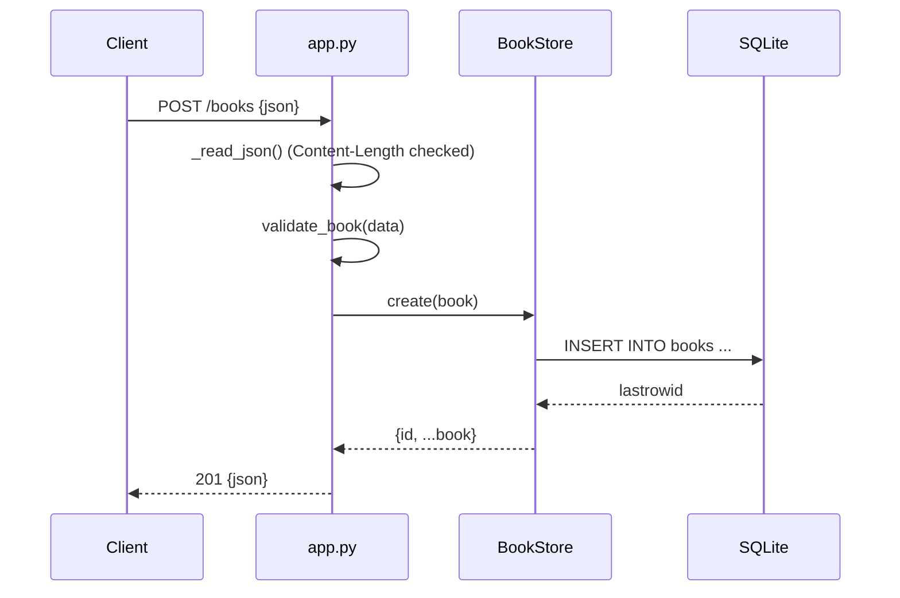

# Flow

A `POST /books` request is read with a `Content-Length` guard (max 1 MB), parsed as JSON, and validated by `validate_book` (title/author required non-empty; year optional int with an explicit bool reject; isbn optional str). Valid input is inserted through a lock-guarded `BookStore` into SQLite and returned as `201` with the generated `id`. Validation failures return `400` with a per-field `details` object; malformed/non-object bodies return `400`. Access to the shared connection is serialized with a `threading.Lock`, and the handler uses `HTTP/1.0` so a rejected request with an unread body cannot desynchronize a kept-alive socket.
