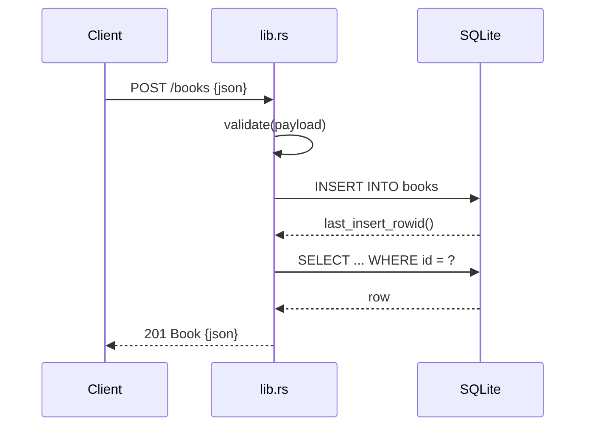

# Flow

A `POST /books` request is validated (`validate` trims and requires non-empty
`title`/`author`, bounds `year` to 0–9999). On success the handler acquires the
shared `Mutex<Connection>`, inserts the row, re-reads it by `last_insert_rowid()`
to echo the persisted record, and returns `201`. Validation failures short-circuit
to `422` with a `details` array; malformed JSON is caught via `JsonRejection` and
mapped to `400`. Persistence is a single SQLite connection behind a mutex (poison
tolerant), shared across async handlers.
