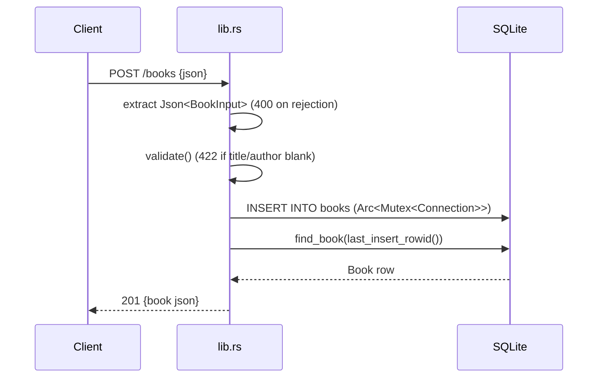

# Flow

A `POST /books` first tries the axum `Json` extractor; a `JsonRejection` (malformed body or wrong field type) maps to `400`. The parsed `BookInput` is validated — a blank/missing title or author yields `422` with a `details` list. On success the handler locks the shared SQLite connection, inserts the row, re-reads it by `last_insert_rowid()`, and returns `201`. Persistence is synchronous SQLite behind an `Arc<Mutex<Connection>>` (the mutex is recovered from poisoning); errors from rusqlite map to `500` via `ApiError::Internal`.
