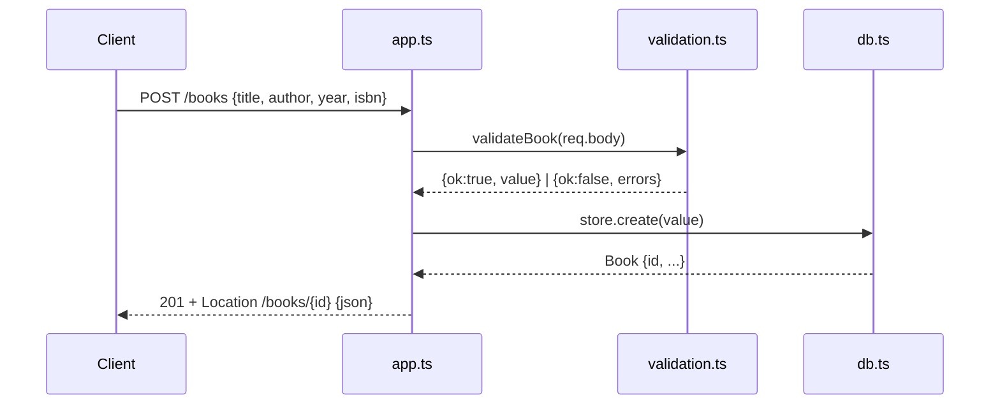

# Flow

A `POST /books` request is parsed by `express.json()`, validated by `validateBook` (title and author required non-empty; year must be an integer; isbn a non-empty string when present), then persisted through the prepared `INSERT` in `BookStore.create`. The handler returns `201` with a `Location` header and the created book. Validation failures short-circuit to `400` with a details array; malformed JSON is caught by the trailing error handler and returned as `400 {error:"invalid JSON body"}`. Input validation, JSON error handling, and case-insensitive author filtering are all present.
