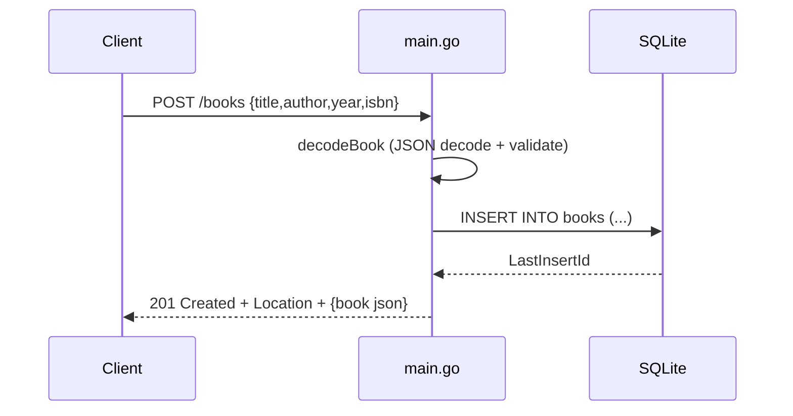

# Flow

A request to `POST /books` is decoded and validated by `decodeBook` (title and author
must be non-empty after trimming; malformed JSON or missing fields yield 400). On success
the handler inserts the row via a parameterized `INSERT`, sets the new id and a `Location`
header, and returns the book as JSON with 201. Persistence is real SQLite via the pure-Go
`modernc.org/sqlite` driver with `SetMaxOpenConns(1)` to keep `:memory:` databases
consistent. All handlers use request-context-aware queries and return `{"error":...}` JSON
bodies with appropriate status codes.
