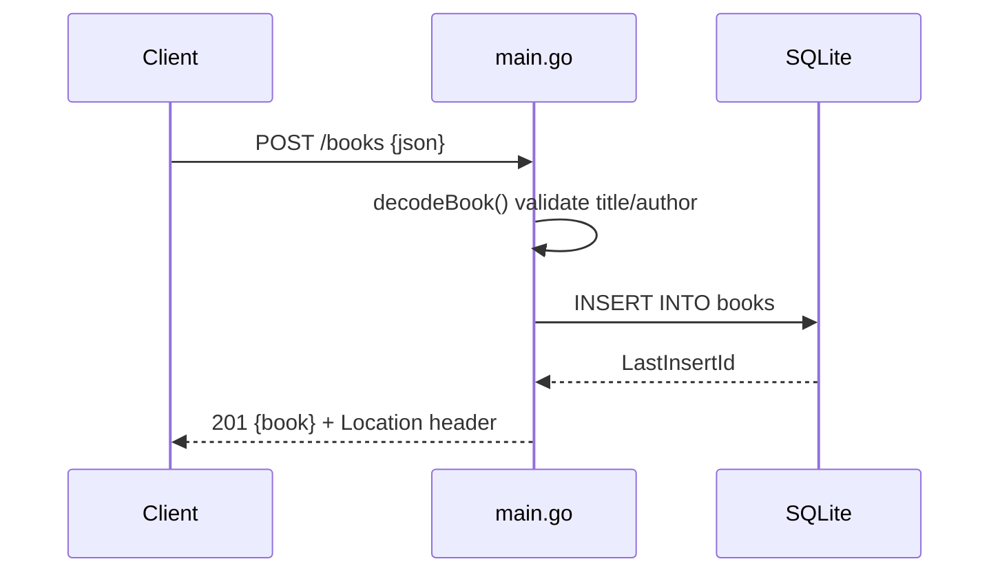

# Flow

A request to `POST /books` is routed by the stdlib `http.ServeMux` method pattern to `createBook`, which calls `decodeBook` to parse the JSON body (capped at 1 MiB via `MaxBytesReader`) and reject empty `title`/`author` with 400. On success it runs a parameterized `INSERT` against the single-connection SQLite handle, sets the new `id` from `LastInsertId`, adds a `Location: /books/{id}` header, and returns the book as JSON with 201. Errors map to appropriate status codes (400 validation, 404 not-found, 500 internal); no pagination on the list route, and PUT is a full replace rather than a partial patch.
