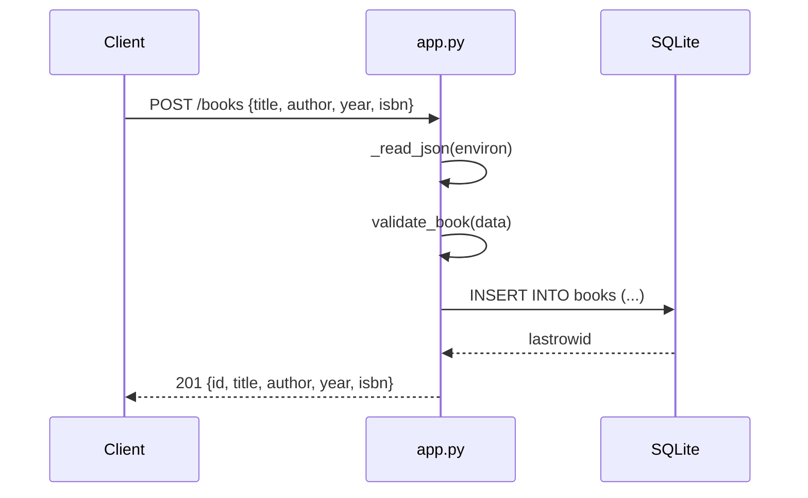

# Flow

A `POST /books` request is dispatched by `BookApp._route`, which reads and
JSON-parses the body (`_read_json`, enforcing a 1 MiB cap), validates it with
`validate_book` (title/author required non-empty strings; year int-or-null;
isbn str-or-null), inserts a row via a fresh short-lived SQLite connection, and
returns `201` with the created record. Errors are funnelled through `ApiError`
in `__call__`, which maps them to the appropriate status code and a JSON
`{"error": ...}` body; unexpected exceptions become `500`. A new connection is
opened per operation (no pooling) — fine for this single-file stdlib design.
