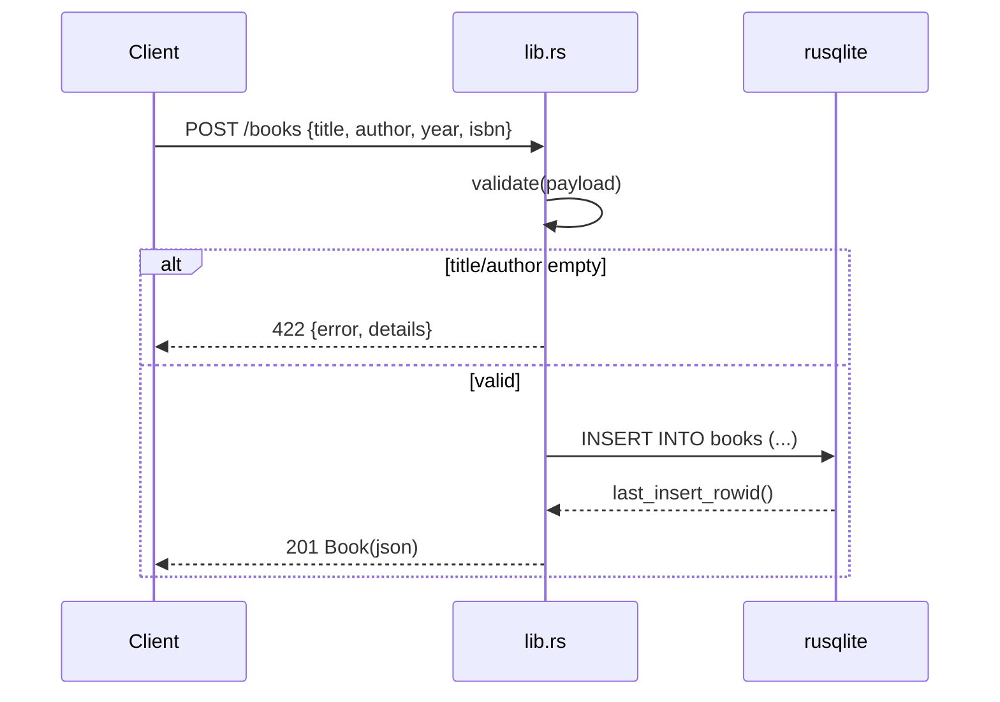

# Flow

A `POST /books` request is parsed into `BookInput`; `validate()` trims and rejects an empty
`title` or `author` with `422 Unprocessable Entity` (a malformed JSON body yields `400`
via `JsonRejection`). Valid input is inserted through a single `Arc<Mutex<Connection>>`
SQLite handle and echoed back as a `201` JSON `Book`. All handlers share this locked
connection; persistence is synchronous inside async handlers (acceptable at this scale).
Note the deviation from the spec's suggested `400` for validation: the code returns `422`.
