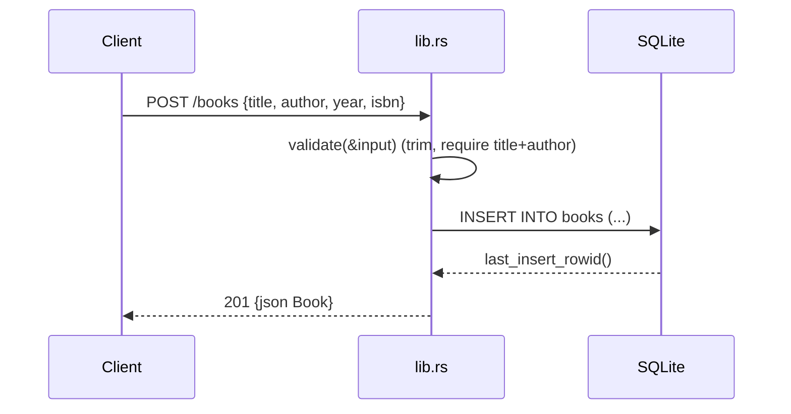

# Flow

A `POST /books` request is deserialized into `BookInput`; a `JsonRejection` short-circuits to `400`. `validate()` trims and requires non-blank `title` and `author`, returning `422` with a `details` array on failure. On success the handler locks the shared `Arc<Mutex<Connection>>`, inserts the row, and returns the created `Book` (with its new id) as `201` JSON. Persistence is synchronous rusqlite calls guarded by a mutex inside async handlers; the DB connection is a single shared connection rather than a pool.
