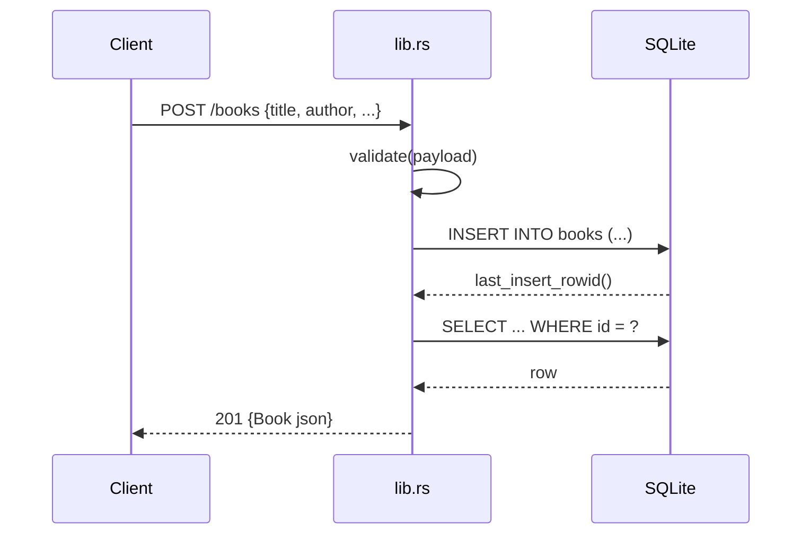

# Flow

A `POST /books` request first runs `validate()`, which rejects malformed JSON and empty/whitespace `title` or `author` with `400 {"error": ...}`. On success it acquires the shared `Mutex<Connection>` lock, inserts the row, re-fetches it by `last_insert_rowid()`, and returns `201` with the full book as JSON. All handlers share a single SQLite connection behind an `Arc<Mutex<..>>`, so DB access is serialized across requests. Errors flow through the `ApiError` enum whose `IntoResponse` impl maps each variant to the appropriate status code plus a JSON error body.
