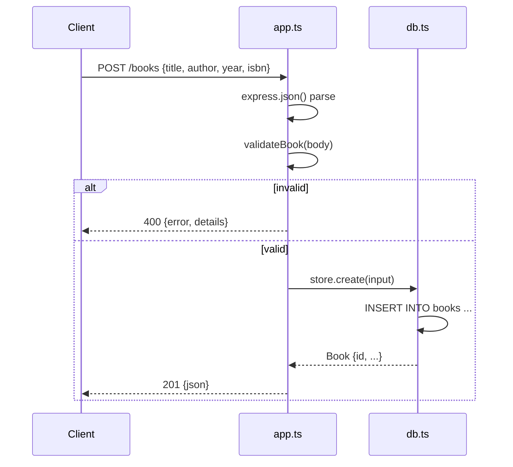

# Flow

A `POST /books` request is JSON-parsed by `express.json()`, then validated by `validateBook`, which requires non-empty `title` and `author` and type-checks the optional `year` (integer) and `isbn` (string). Invalid input returns `400` with a `details` array before touching the DB. Valid input is inserted through a prepared statement in `BookStore.create`, which returns the row with its autoincrement `id`, and the handler responds `201`. Persistence is real SQLite via Node's built-in `node:sqlite` (`:memory:` in tests, file-backed via `DB_PATH` in `server.ts`). A trailing error middleware maps client JSON-parse errors to `400` and everything else to `500`.
