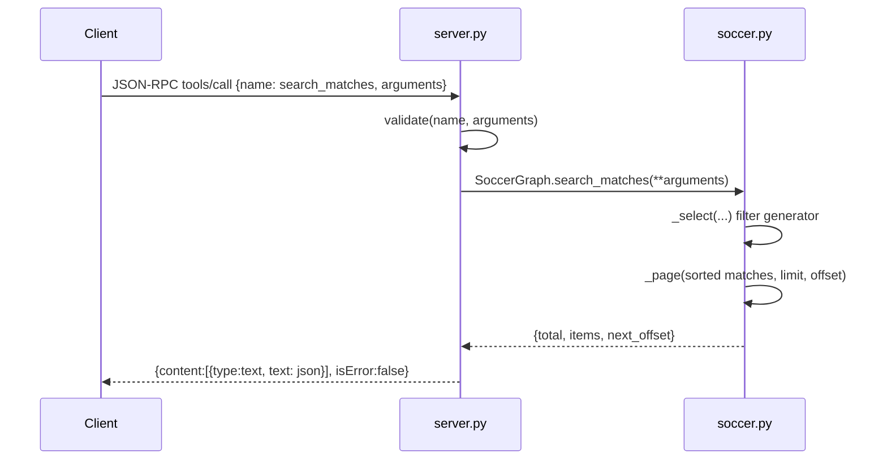

# Flow

At startup `main()` constructs `SoccerGraph`, which eagerly reads all six CSVs from `data/kaggle/`, normalizes team names and dates, deduplicates matches across sources (merging cross-source fixtures within a ±1 day window for time-zone differences), infers Copa do Brasil finals, and builds a typed node/edge graph. The server then reads JSON-RPC requests line-by-line from stdin. A `tools/call` is validated against the tool's schema (unknown/missing/typed args rejected), dispatched to the matching `SoccerGraph` method, and the result serialized as MCP text content with `allow_nan=False`. Errors from the graph layer (`ValueError`/`TypeError`) are returned as `isError:true` tool results rather than JSON-RPC errors; malformed requests return JSON-RPC error codes. Notable: entirely standard-library (no MCP SDK, no pandas); very dense single-line style; `initialize` gates all non-ping tool methods.
