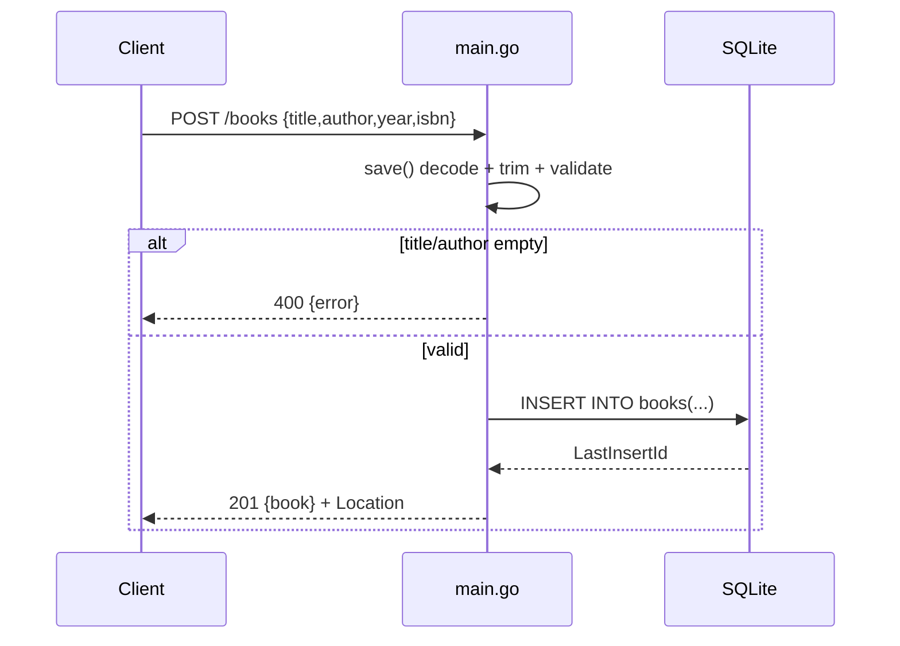

# Flow

A `POST /books` request is routed by `API.ServeHTTP`, which dispatches to `save()`. The handler caps the body at 1 MiB (`http.MaxBytesReader`), decodes JSON with `DisallowUnknownFields`, rejects trailing data, trims and validates that title and author are non-empty (else 400), inserts into SQLite, and returns 201 with the created book and a `Location` header. Reads go through `database/sql` with parameterized queries (no string interpolation), and `SetMaxOpenConns(1)` serializes access to the single SQLite file.
