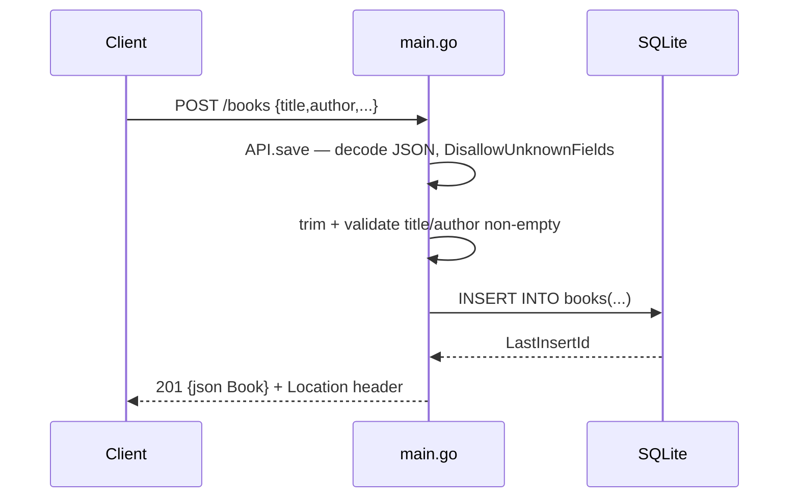

# Flow

A `POST /books` request is routed by `API.ServeHTTP` to `API.save`. The body is read through a 1 MiB `MaxBytesReader` and decoded with `DisallowUnknownFields`; a trailing second decode enforces exactly one JSON object. Title and author are trimmed and rejected (400) if empty. The book is inserted via a parameterized SQL statement (SQL-injection safe — a test exercises `?author=' OR 1=1--`), and the created row is returned as JSON with a `Location` header. All handlers share a single `*sql.DB` capped at one open connection with a 5 s busy timeout, and the server installs SIGINT/SIGTERM graceful shutdown.
