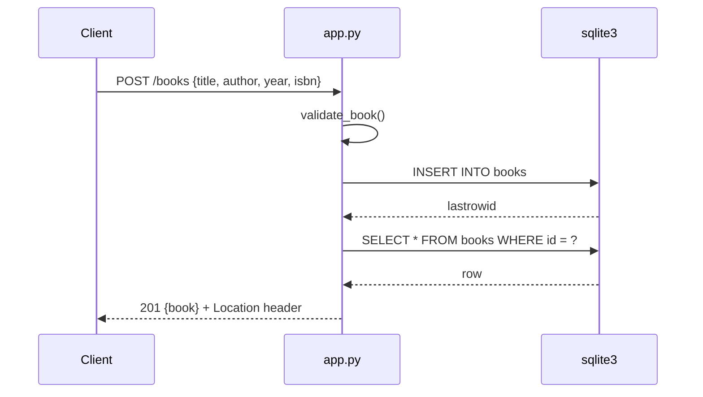

# Flow

`POST /books` validates the JSON body in `validate_book()` (object required; only the four known fields; non-blank string title/author; integer year 1–9999 or null; non-blank string isbn or null; strings trimmed), inserts the row inside a `with connection` transaction, re-reads it via `get_book_or_404`, and returns it as JSON with 201 and a `Location` header. A per-request connection is stored on `flask.g` and closed on app-context teardown. Validation failures raise `BadRequest`, which the global `HTTPException` handler renders as `{"error": description}`.
