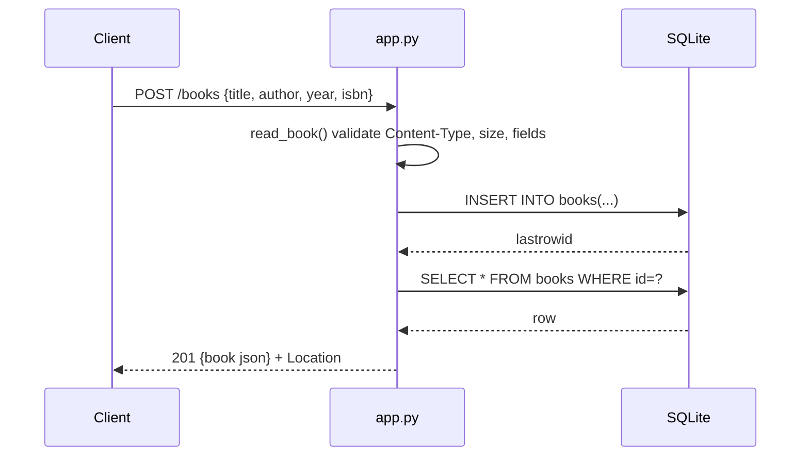

# Flow

A `POST /books` first runs `read_book()`, which enforces `Content-Type: application/json`, a ≤1 MiB body, a JSON object with only the known fields, nonblank string `title`/`author`, and optional typed `year`/`isbn`. On success a fresh SQLite connection (opened per request via `connect()`, wrapped in `closing`) inserts the row inside a transaction, re-selects it, and returns `201` with a `Location` header. Errors are funneled through a single `APIError`/`sqlite3.Error` handler in `__call__` that emits JSON with the right status. Notable: parameterized SQL throughout (a SQL-injection filter case is explicitly tested); IDs handled as strings to avoid integer overflow; DELETE returns a bodyless 204; PUT is full-replace (omitted optional fields reset to null).
