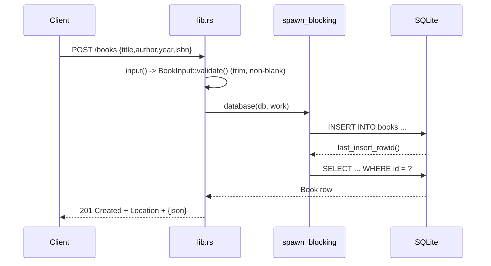

# Flow

A `POST /books` request is first deserialized and validated by `input()`/`BookInput::validate()` (whitespace trimmed; blank title or author → 400; unknown fields rejected via `deny_unknown_fields`). The work then runs on Tokio's blocking pool through the `database()` helper, which locks the shared `Arc<Mutex<Connection>>`, inserts the row, and re-selects it by `last_insert_rowid()` to return the persisted `Book`. The response is 201 with a `Location` header and the JSON body. SQLite access is serialized per process behind a mutex and dispatched off the async worker threads; a table-level `CHECK` constraint mirrors the application validation, and DB errors are mapped to 500 without leaking details.
