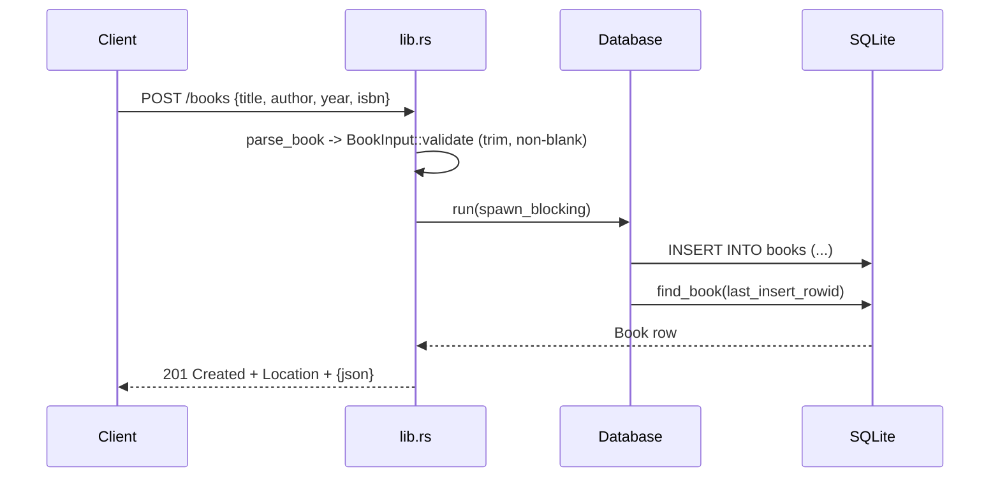

# Flow

A `POST /books` request is decoded into `BookInput`; `parse_book` maps JSON/422 rejections to 400 and `validate` trims `title`/`author` and rejects blanks. The DB work runs on a blocking worker thread (`spawn_blocking`) holding a `Mutex<Connection>`: it inserts the row, re-reads it via `find_book`, and returns `201` with a `Location: /books/{id}` header and the JSON body. Validation is enforced in two layers — application-side in `validate` and at the schema via `CHECK` constraints. Errors are uniform `{"error": ...}` JSON. DB access is synchronous under a global mutex (single writer), which is correct but serializes all requests.
