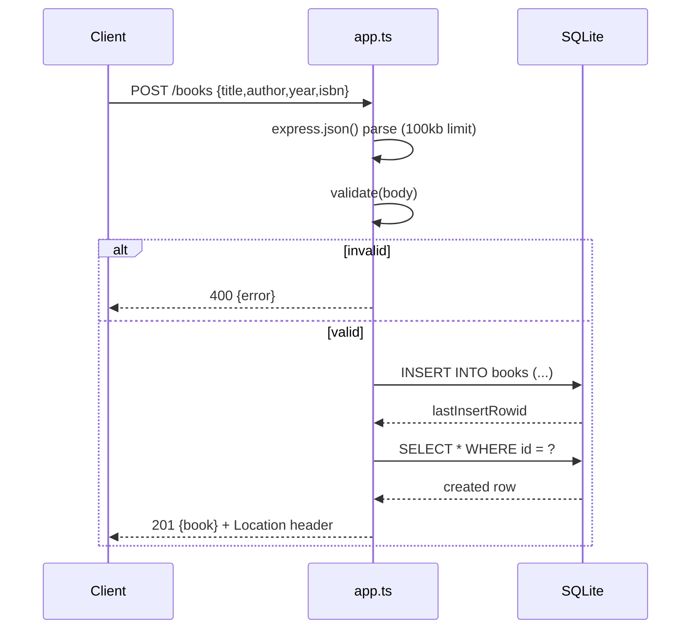

# Flow

A `POST /books` request is JSON-parsed (bodies over 100 KB rejected with 413), then `validate()` requires non-empty `title` and `author` strings and type-checks optional `year`/`isbn`, throwing→400 on any failure. On success the row is inserted with bound parameters, re-selected by `lastInsertRowid`, and returned as 201 with a `Location: /books/{id}` header. All SQL uses bound parameters (verified by the author-filter test issuing `' OR 1=1 --` as data). Persistence is on-disk SQLite via `node:sqlite`, so data survives process restart (covered by the reopen test).
