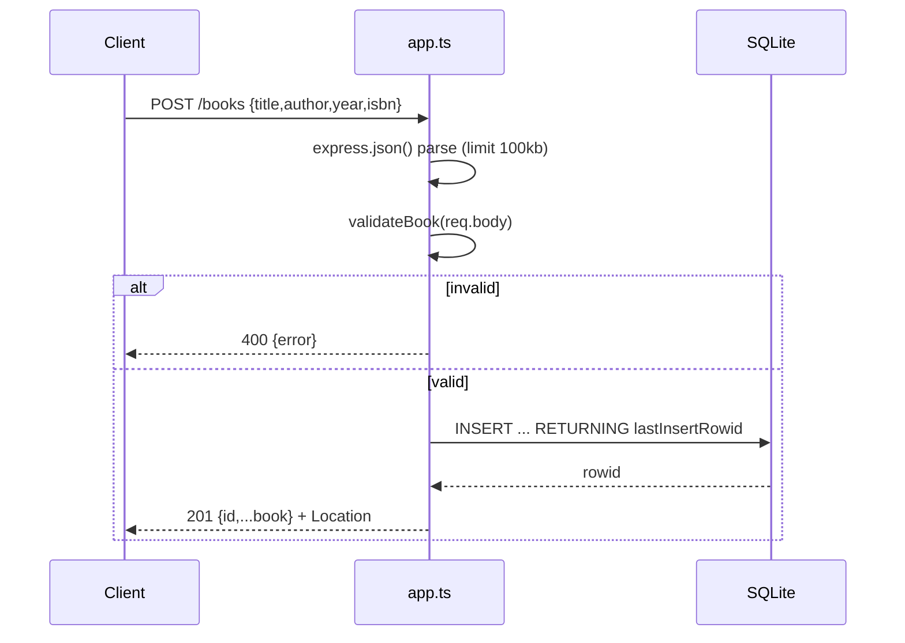

# Flow

A `POST /books` request is JSON-parsed (bodies over 100 KB rejected with 413), then `validateBook` enforces non-blank string `title`/`author` and optional-type checks on `year` (safe integer or null) and `isbn` (non-blank string or null), trimming strings. On success a parameterized `INSERT` persists the row to SQLite and the handler returns `201` with the created book and a `Location` header. Notable: input validation is present and thorough; SQL injection is avoided via prepared statements; ids are validated by an `app.param` guard; a terminal error middleware maps thrown errors to 400/413/500; PUT is a full replace (omitted optional fields become null).
