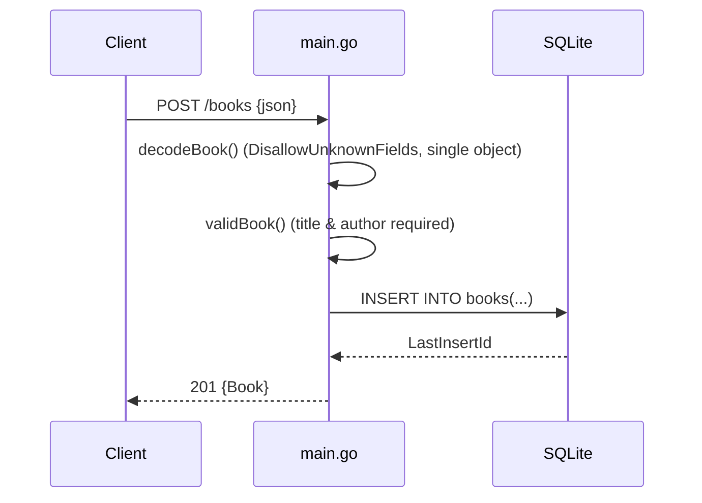

# Flow

A `POST /books` request is decoded with `DisallowUnknownFields` and a
single-object guard (rejecting trailing JSON), validated so that `title` and
`author` are non-empty after trimming, then inserted via a parameterized
`INSERT`. The generated row id is returned in a `201 Created` JSON body. Reads
and writes go directly to SQLite through `database/sql` with context-aware
queries; errors are mapped to `500`, missing rows to `404`, and bad input to
`400`. Path ids are passed to SQLite as parameters rather than parsed to int,
so a non-numeric id simply matches no row and yields `404`.
