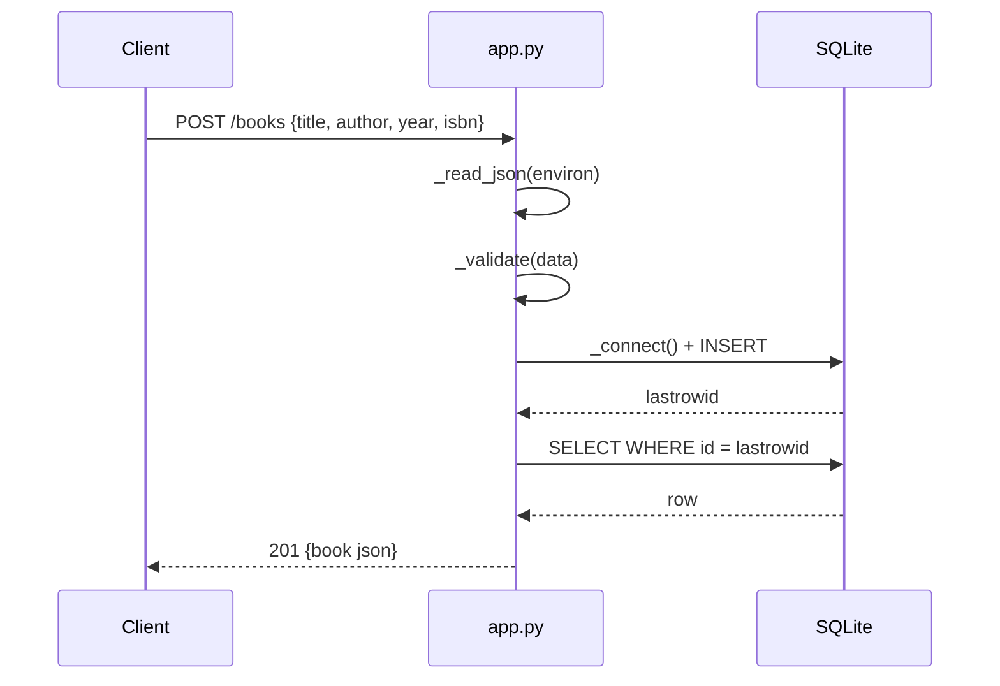

# Flow

A `POST /books` request is dispatched by the single `app` WSGI callable, which
routes purely on `PATH_INFO` and `REQUEST_METHOD`. The body is parsed by
`_read_json` (returns `None` on malformed JSON, which `_validate` then rejects
as a missing title). `_validate` enforces required non-empty `title`/`author`
and type-checks `year`/`isbn`. A fresh SQLite connection is opened per request
(the `books` table is created if absent), the row is inserted and committed,
then re-selected and returned as JSON with status 201. Every handler opens and
closes its own connection in a `finally` block. No pagination; the `?author=`
filter is applied in SQL via a nullable-parameter WHERE clause.
