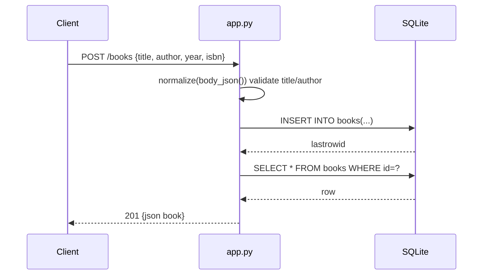

# Flow

A `POST /books` request reads the JSON body (`body_json`), validates that `title` and `author` are non-empty strings and that `year`/`isbn` have the right types (`normalize`); on failure it returns `400`. On success it opens a fresh SQLite connection per request (`connect`), inserts the row, re-selects it by `lastrowid`, and returns `201` with the created book as JSON. Each handler method opens its own short-lived connection (no shared pool). Route-to-id parsing is done by a static `book_id()` helper that only accepts numeric ids. The `?author=` filter uses a `LIKE '%…%' COLLATE NOCASE` substring match rather than exact equality.
