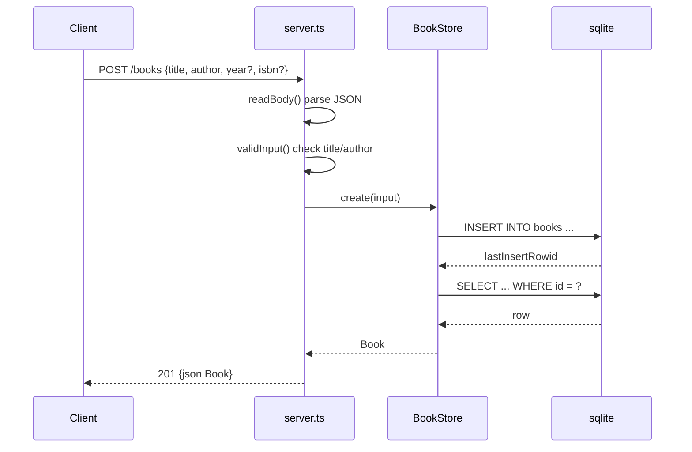

# Flow

A `POST /books` request is read fully, parsed as JSON (invalid JSON → 400), and validated: `title` and `author` must be non-empty strings, `year` if present an integer, `isbn` if present a string; failing validation returns 400. `BookStore.create` inserts via a prepared statement and re-selects the row to return the persisted `Book` with its generated `id`. All responses are JSON via a shared `send()` helper that sets `content-type: application/json`. Routing is hand-rolled with `URL` parsing and a `/^\/books\/(\d+)$/` regex; ids that overflow a safe integer return 400. No auth, no pagination, no request logging — consistent with the task scope.
