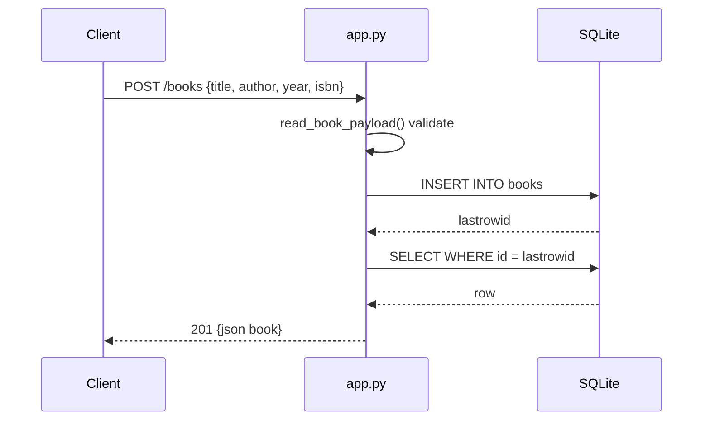

# Flow

A `POST /books` request is parsed and validated by `read_book_payload()` (title and author must be non-empty strings; year must be int-or-null; isbn str-or-null). On success a new `books` row is inserted, re-selected to capture the autoincrement id, and returned as JSON with status 201; a validation error returns 400. Each request opens its own SQLite connection via `connect_db()` (which also creates the table if absent) — synchronous, connection-per-request, no pooling.
