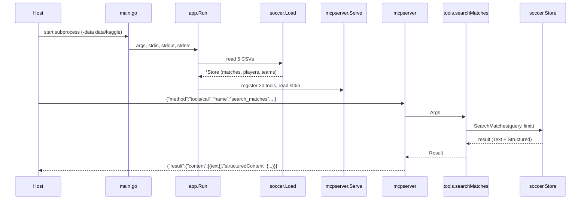

# Flow

An MCP host launches the binary as a subprocess. `app.Run` loads all six Kaggle
CSVs once into an in-memory `Store` (deduping matches recorded by multiple
sources within a 3-day window, inferring Copa do Brasil knockout stages, and
normalizing team names), then serves JSON-RPC line by line over stdin/stdout.
Each `tools/call` is dispatched by name to a handler in `tools.go`, which
coerces the loosely-typed arguments, resolves team/competition names, queries
the `Store`, and returns both a human-readable `Text` rendering and a
`structuredContent` object. Tool-handler errors are returned as MCP error
results (`isError: true`) rather than protocol errors, and a `recover` guards
against handler panics. Notable: no network calls, no persistence, no
pagination state (each call is stateless); all computation is over the
in-memory slices built at startup.
