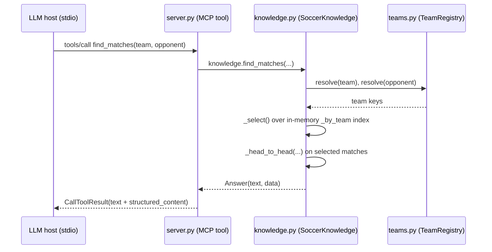

# Flow

A typical request is the host calling the `find_matches` tool (e.g. "Show me all Flamengo vs Fluminense matches"). `server.py` forwards it to `SoccerKnowledge.find_matches`, which resolves each team name to a stable key via `TeamRegistry.resolve` (accent-, case- and suffix-insensitive), filters the pre-built in-memory `_by_team` index through `_select`, computes a head-to-head when both teams are named, and returns an `Answer` carrying both a human-readable string and the same facts as JSON. The server wraps that in a `CallToolResult`. All data is loaded and merged once at start-up (`load_all` → `_merge` → sorted indexes), so queries touch only memory.

Deviations from common patterns worth noting:
- No HTTP layer, no database, no network calls — everything is in-memory over local CSVs, loaded eagerly at construction.
- No pagination; results are capped by a `limit` argument and surplus is reported as a "... N more" line.
- Error handling is uniform: data-level failures raise `QueryError`, converted to an MCP `ToolError` with a helpful message (including "did you mean" suggestions for unknown teams) rather than crashing.
- Input normalization is heavy and deliberate (team-name parsing, multi-format date parsing, cross-dataset de-duplication), reflecting the task's data-quality notes.
- Missing/broken dataset files are reported to stderr at start-up, not fatal.
