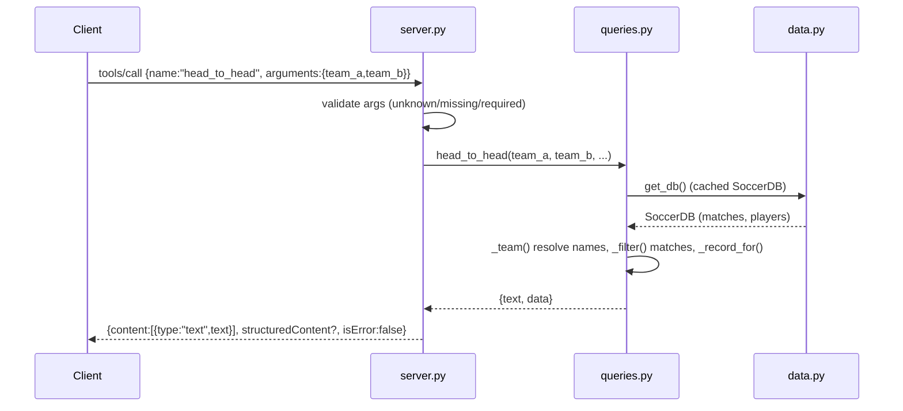

# Flow

A client sends `tools/call` over stdio. `MCPServer._call_tool` looks the tool up in
`TOOLS_BY_NAME`, rejects unknown/missing-required arguments with an `isError` tool
result, then calls the wrapped `queries` function. On first use the query layer lazily
loads and caches the unified `SoccerDB` from the six CSVs (`data.py:get_db()` — loaded
eagerly at `initialize`). Team names are resolved via `brsoccer.teams`, matches filtered
and aggregated in memory, and the function returns a human-readable `text` plus a
machine-readable `data` payload. The server wraps `text` as text content and, for
protocol ≥ 2025-06-18, attaches `structuredContent`. `QueryError` and `TypeError`/
`ValueError` are turned into `isError` tool results rather than JSON-RPC errors.

Notable: pure stdlib, no pandas/MCP-SDK dependency in the server; all data held in
memory for the process lifetime; CSV merge deduplicates fixtures shared across files so
standings/statistics never double-count; errors surface as helpful messages (e.g. team
suggestions) rather than raw stack traces.
