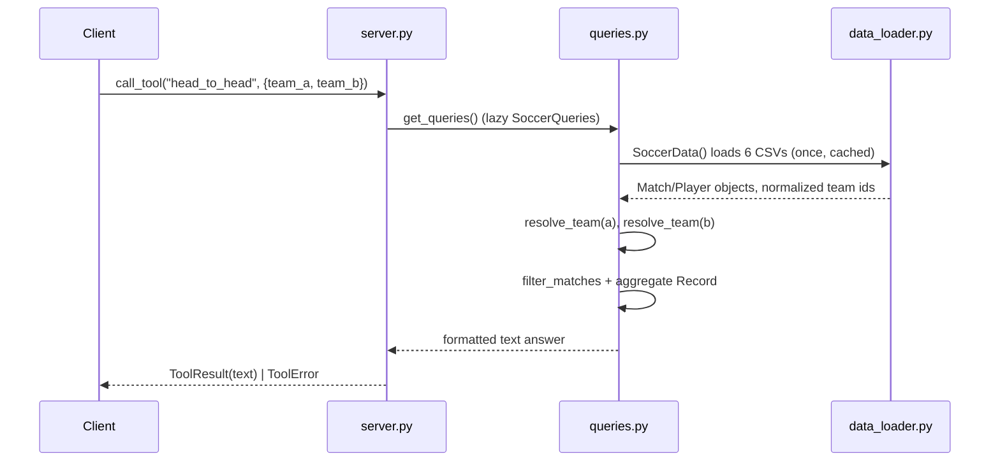

# Flow

A tool call enters `server.py`, which lazily constructs a single `SoccerQueries` (triggering `SoccerData` to read and normalize all six CSVs once, cached for the process). The query resolves fuzzy team names to canonical ids, filters the in-memory match list, aggregates a `Record`, and returns a formatted string. `QueryError` is caught and re-raised as an MCP `ToolError`. Data is loaded eagerly in `main()` before serving so the first request isn't slow.

Notable: all data is in-memory (no DB); team-name normalization is a central concern handled in `team_names.py`/`data_loader.py`; standings are computed on demand from match results (with a `_standings_cache`); no external API calls (optional APIs in the spec are deliberately not dialled). Output is rendered text rather than structured JSON objects.
